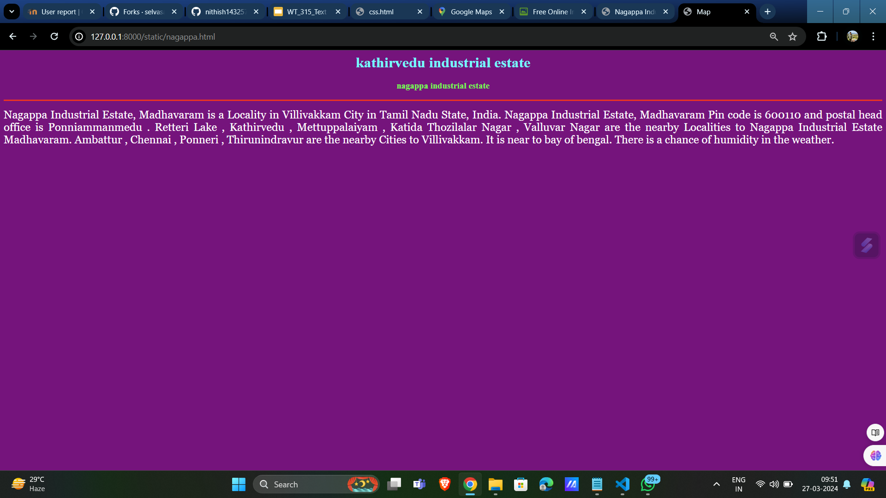
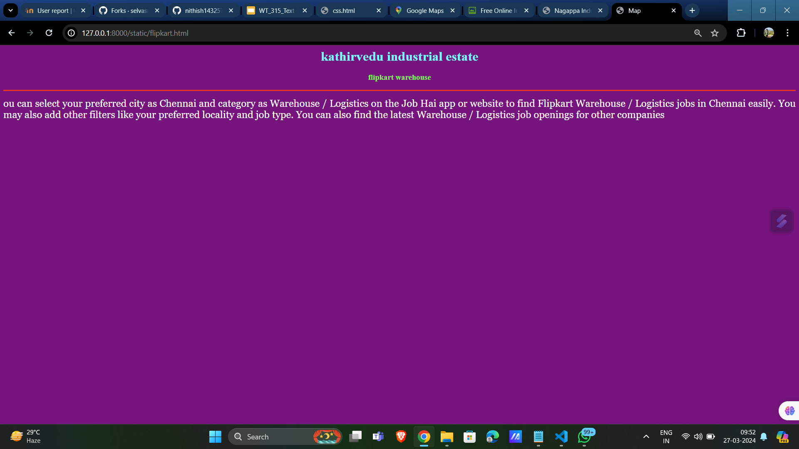
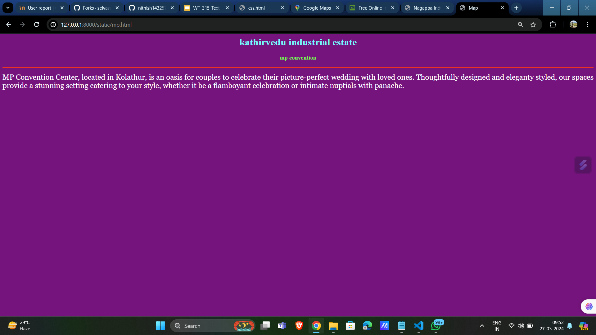
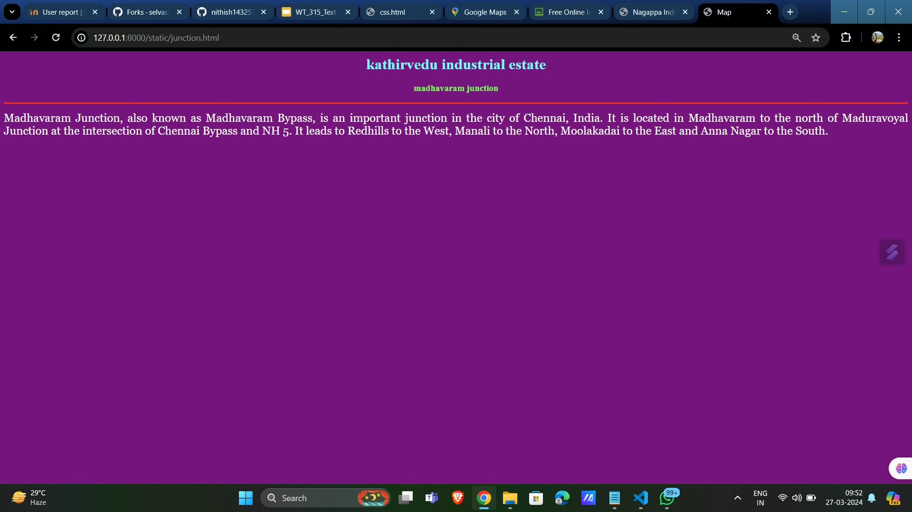
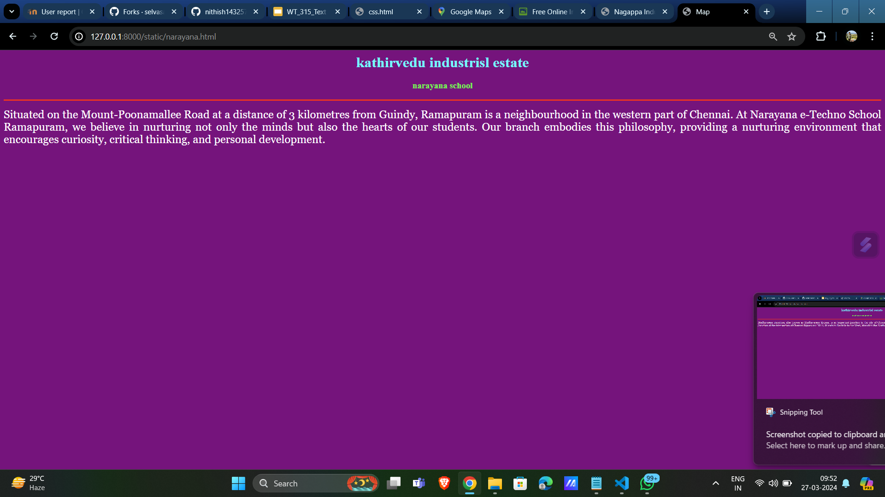

# Ex04 Places Around Me
## Date: 28/03/2024

## AIM
To develop a website to display details about the places around my house.

## DESIGN STEPS

### STEP 1
Create a Django admin interface.

### STEP 2
Download your city map from Google.

### STEP 3
Using <map> tag name the map.

### STEP 4
Create clickable regions in the image using <area> tag.

### STEP 5
Write HTML programs for all the regions identified.

### STEP 6
Execute the programs and publish them.

## CODE

map.html

<html>
    <head>
        <title>Map</title>
    </head>
    <body>
        <h1 align="center">
            <b>kathirvedu industrial estate</b>
        </h1>
        <h3 align="center">
            <b>chandramohan s(212221223002)</b>
        </h3>
        

           

<map name="image-map">
    <area target="" alt="mp convention" title="mp convention" href="mp.html" coords="1151,531,1217,598" shape="rect">
    <area target="" alt="narayana school" title="narayana school" href="narayana.html" coords="1241,375,100" shape="circle">
    <area target="" alt="nagapa industrial estate" title="nagapa industrial estate" href="nagappa.html" coords="1599,270,1560,404" shape="rect">
    <area target="" alt="madhavaram junction" title="madhavaram junction" href="junction.html" coords="1821,140,130" shape="circle">
    <area target="" alt="flipkart warehouse" title="flipkart warehouse" href="flipkart.html" coords="540,305,663,401" shape="rect">
</map>        
  
    </body>
</html>

junction.html

<html>
    <head>
        <title>Map</title>
    </head>
    <body bgcolor="purple">
        <h1 align="center">
            <b>kathirvedu industrial estate</b>
        </h1>
        <h3 align="center">
            </b>madhavaram junction
        </h3>
        

        

            
                Madhavaram Junction, also known as Madhavaram Bypass, is an important junction in the city of Chennai, India. It is located in Madhavaram to the north of Maduravoyal Junction at the intersection of Chennai Bypass and NH 5. It leads to Redhills to the West, Manali to the North, Moolakadai to the East and Anna Nagar to the South.
            
        

    </body>
</html>

narayana.html

<html>
    <head>
        <title>Map</title>
    </head>
    <body bgcolor="purple">
        <h1 align="center">
            <b>kathirvedu industrisl estate</b>
        </h1>
        <h3 align="center">
            </b>narayana school
        </h3>
        

        

            
                Situated on the Mount-Poonamallee Road at a distance of 3 kilometres from Guindy, Ramapuram  is a neighbourhood in the western part of Chennai. At Narayana e-Techno School Ramapuram, we believe in nurturing not only the minds but also the hearts of our students. Our branch embodies this philosophy, providing a nurturing environment that encourages curiosity, critical thinking, and personal development.
 
            
        

    </body>
</html>

mp.html

<html>
    <head>
        <title>Map</title>
    </head>
    <body bgcolor="purple">
        <h1 align="center">
            <b>kathirvedu industrial estate</b>
        </h1>
        <h3 align="center">
            </b>mp convention
        </h3>
        

        

            
                MP Convention Center, located in Kolathur, is an oasis for couples to celebrate their picture-perfect wedding with loved ones. Thoughtfully designed and eleganty styled, our spaces provide a stunning setting catering to your style, whether it be a flamboyant celebration or intimate nuptials with panache.
            
        

    </body>
</html>

nagappa.html

<html>
    <head>
        <title>Map</title>
    </head>
    <body bgcolor="purple">
        <h1 align="center">
            <b>kathirvedu industrial estate</b>
        </h1>
        <h3 align="center">
            </b>nagappa industrial estate
        </h3>
        

        

            
                Nagappa Industrial Estate, Madhavaram is a Locality in Villivakkam City in Tamil Nadu State, India.
Nagappa Industrial Estate, Madhavaram Pin code is 600110 and postal head office is Ponniammanmedu .

Retteri Lake , Kathirvedu , Mettuppalaiyam , Katida Thozilalar Nagar , Valluvar Nagar are the nearby Localities to Nagappa Industrial Estate Madhavaram.

Ambattur , Chennai , Ponneri , Thirunindravur are the nearby Cities to Villivakkam.

It is near to bay of bengal. There is a chance of humidity in the weather.
            
        

    </body>
</html>

flipkart.html

<html>
    <head>
        <title>Map</title>
    </head>
    <body bgcolor="purple">
        <h1 align="center">
            <b>kathirvedu industrial estate</b>
        </h1>
        <h3 align="center">
            </b>flipkart warehouse
        </h3>
        

        

            
                ou can select your preferred city as Chennai and category as Warehouse / Logistics on the Job Hai app or website to find Flipkart Warehouse / Logistics jobs in Chennai easily. You may also add other filters like your preferred locality and job type.
                You can also find the latest Warehouse / Logistics job openings for other companies
            
        

    </body>
</html>

## OUTPUT
(<Screenshot 2024-03-27 095130.png>)

## RESULT
The program for implementing image maps using HTML is executed successfully.